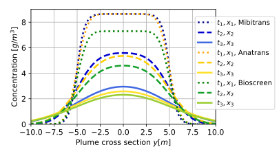
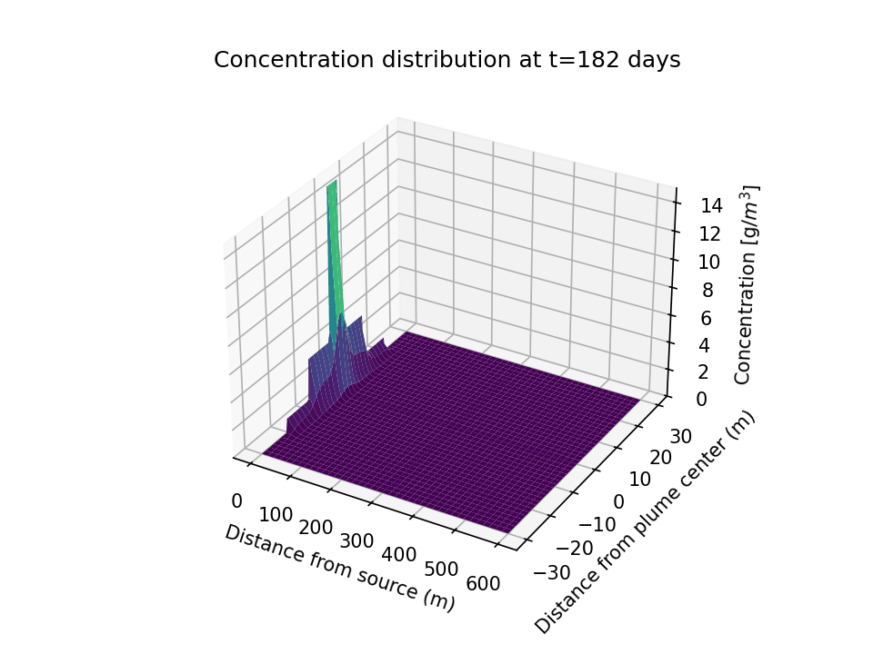

# Documention for `mibitrans` python package

`mibitrans` is an open-source Python-based modeling tool designed for rapid screening of contaminant transport at field sites impacted by petroleum hydrocarbons under natural flow conditions. The tool implements a suite of analytical solutions to the advection–dispersion equation, offering flexible model configurations, multiple representations of (bio)degradation processes, streamlined data handling and visualization capabilities. Its modular architecture allows for straightforward extension and adaptation to site-specific needs.

`mibitrans` can be used to address key questions in contaminated site management, including the feasibility of natural attenuation, expected plume development and spatial extent, and the relative importance of governing transport and degradation processes. It is particularly suited for early-stage site assessment, where fast and robust estimates of plume behavior, mass balances, and parameter sensitivity are required. In addition, the tool allows performing parameter calibration based on field observations and provides a benchmark for more complex numerical models.

Compared to conventional numerical approaches, `mibitrans` enables fast model setup and execution while maintaining conceptual rigor. Its transparent implementation, comprehensive documentation, and relative ease of use makes it accessible to both researchers and practitioners. Beyond research and suitable for practical use, `mibitrans` is particularly valuable in higher education and professional training, where its intuitive setup and rapid feedback facilitate the teaching of core concepts in contaminant transport, support hands-on learning, and help bridge the gap between theoretical understanding and the application of advanced numerical modeling tools.

## How to use mibitrans

Using your preferred Python IDE, install Mibitrans, specify the field conditions and visualize the contaminant distribution.





Look at the examples section for detailed explanation on how to use mibitrans.

## Installation

To install mibitrans from GitHub repository, do:

```console
git clone git@github.com:MiBiPreT/mibitrans.git
cd mibitrans
python -m pip install .
```
